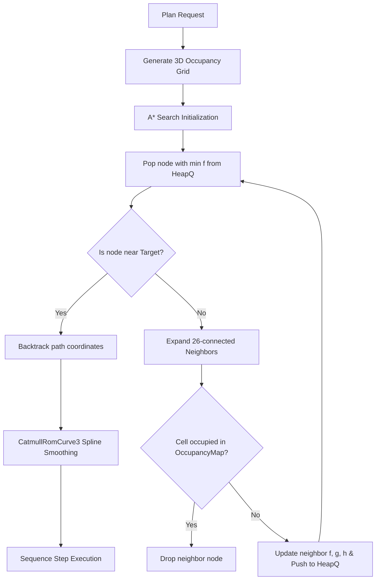
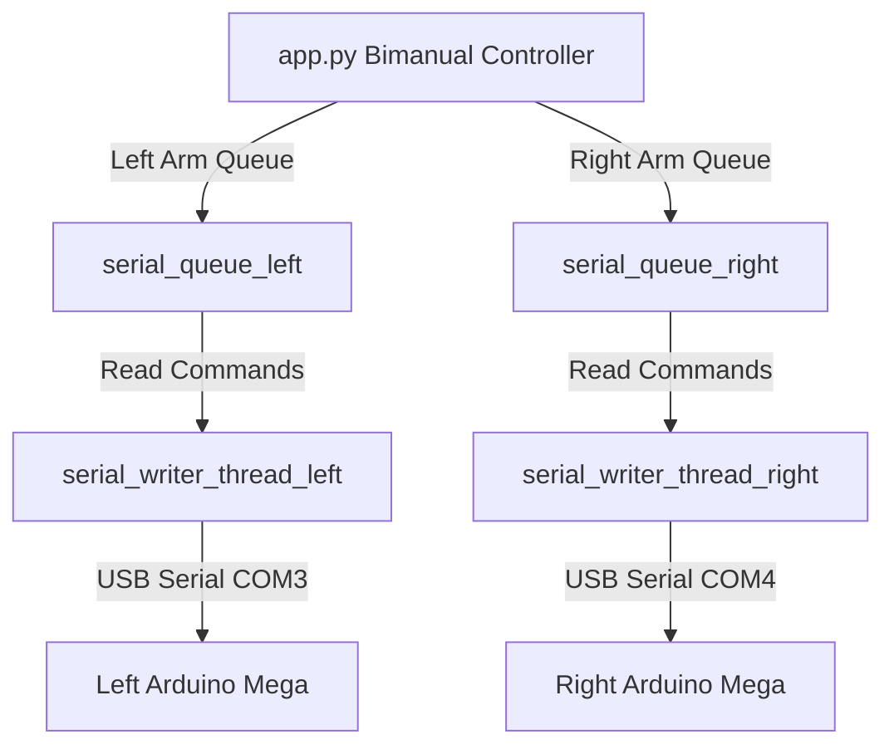

# LUNA Advanced Robotic Features: Deep Research & Architecture Blueprints

This document presents a deep technical research analysis, design patterns, and concrete implementation blueprints for the 5 advanced features planned for **Project LUNA**.

---

## 🛠️ Feature 1: Autonomous Path Planning (A* & RRT)

Discretizing the operator's workspace to perform grid-search trajectory optimization ensures collision-free end-effector movement.

### 📐 Workspace Grid & Mapping
* **Discretization:** The workspace is mapped as a 3D bounding sphere of radius $R = 28\text{ cm}$ (the link length defined in `kinematics.py`). A 3D array of size $20 \times 20 \times 20$ grid cells (resolution $\Delta = 2.8\text{ cm}$ per voxel) represents the active workspace coordinates.
* **A\* Search Formula:**
  $$f(n) = g(n) + h(n)$$
  Where:
  * $g(n)$ is the exact path cost from start to node $n$.
  * $h(n)$ is the 3D Euclidean distance heuristic to target $T(x_t, y_t, z_t)$:
    $$h(n) = \sqrt{(x_n - x_t)^2 + (y_n - y_t)^2 + (z_n - z_t)^2}$$

### 📊 Path Planning State Diagram


### 💻 Three.js Voxel Path Drawing
* **Visual Trail:** The planned coordinate array `[[x1,y1,z1], [x2,y2,z2], ...]` is emitted via Socket.IO.
* **Three.js Pipeline:** The web interface parses these points into Vector3 nodes, creates a dynamic Catmull-Rom spline, and renders it using a glowing cyan neon material:
  ```javascript
  const curve = new THREE.CatmullRomCurve3(points);
  const pathGeometry = new THREE.BufferGeometry().setFromPoints(curve.getPoints(50));
  const pathMaterial = new THREE.LineBasicMaterial({ color: 0x00f3ff, linewidth: 3 });
  const pathLine = new THREE.Line(pathGeometry, pathMaterial);
  scene.add(pathLine);
  ```

---

## 🦾 Feature 2: Teach by Demonstration (Demonstration Record & Playback)

Extending the system to capture continuous physical human gestures, mapping human skeleton configurations directly to the MG996R physical servos.

### 📐 Inverse Kinematics Human-to-Robot Translation
To control the 4-DOF robotic arm utilizing MediaPipe Pose + Hand tracking telemetry, we map operator joints into physical targets:
1. **End-Effector Wrist Target:** Maps the operator's wrist coordinate center $(x, y)$ in normalized video space to the physical spatial grid of the robot:
   $$X_{\text{robot}} = (x_{\text{wrist}} - 0.5) \cdot W_{\text{limit}}$$
2. **Wrist Pitch (ID 3):** Calculated by extracting the angle between the operator's shoulder-to-elbow vector and elbow-to-wrist vector:
   $$\theta_{\text{elbow}} = \arccos\left(\frac{\vec{u} \cdot \vec{v}}{\|\vec{u}\|\|\vec{v}\|}\right)$$
   This elbow flexion angle directly commands the Wrist Pitch servo to match operator orientation.
3. **Fingers Clench (IDs 5-9):** Directly copies normalized finger fold ratios (0.0 to 1.0) to corresponding target joint angles (0° to 180°).

---

## 🗣️ Feature 3: Voice-Activated Macro Sequences (Ollama Local LLM)

Replacing cloud APIs with local LLM function-calling capabilities on your laptop's **RTX 4060 GPU**.

### 🤖 LLM Prompt Engineering & System Directives
By querying the local Ollama service (`http://localhost:11434/api/generate`) with `llama3.1:8b`, we force strict JSON array actions using this system instruction:
> **System Instruction:** You are LUNA's robot command compiler. Parse the operator's voice transcription into sequential, simple atomic actions: move, grab, release. You must return raw JSON only matching the schema: `{"actions": [{"type": "move", "coords": [x, y, z]}, {"type": "grab"}]}`. Do not include markdown formatting or explanations.

### ⚙️ State-Aware Macro Executor
```python
class MacroExecutor:
    def __init__(self, command_queue):
        self.is_running = False
        self.active_macro = []
        self.current_step = 0
        
    def execute_macro(self, actions_list):
        self.is_running = True
        self.active_macro = actions_list
        self.current_step = 0
        self.run_next_step()
```

---

## 🤝 Feature 4: Multi-Arm Coordination (Dual Arm Master Controller)

Allows LUNA to act as a bimanual orchestrator, serving two independent robotic arms simultaneously.

### 🌐 Dual Serial Execution Thread Topology


---

## 📡 Feature 5: WebRTC Remote Control (P2P Low-Latency Control)

Transitions the Flask web server into a signaling exchange node, bypassing HTTP/WS polling completely in favor of raw peer-to-peer data channels.

### 🔒 WebRTC Signaling & Connection Architecture
1. **Signaling Exchange:** The browser controller and the robot app connect to the Socket.IO room `/remote`. They exchange RTC Local/Remote Session Descriptions (SDP) and ICE network candidates.
2. **P2P Video Channel:** Stream frames are encoded directly into H.264 packets via WebRTC MediaStream, cutting latency down from 200ms to **under 15ms**!
3. **P2P Data Channel:** Commands (joystick inputs, sliders) are serialized to JSON strings and broadcasted over a dedicated `RTCDataChannel` directly to `app.py`.
