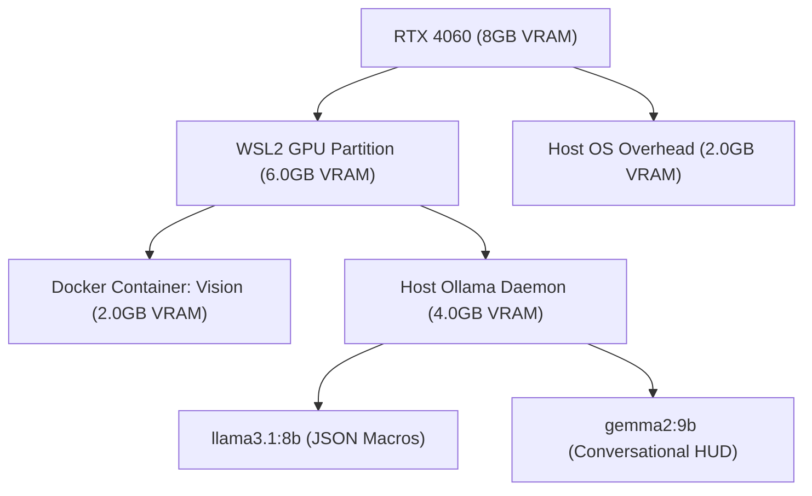

# ==============================================================================
# LUNA ROBOTIC MANIPULATOR: RTX 4060 LAPTOP MIGRATION & OPERATIONAL MANUAL
# ==============================================================================
# Document Version: 1.0.0
# Security Classification: RESTRICTED - MISSION CRITICAL
# Target Compute Profile: NVIDIA GeForce RTX 4060 (8GB VRAM) / 16GB Host RAM
# Workspace Origin: c:\Users\venka\Desktop\final robotic hand\robotic-hand
# ==============================================================================

This document provides the exhaustive, end-to-end blueprint for migrating, configuring, and operating the LUNA (Logical Utility & Neural Arm) Cybernetic Platform on the target **RTX 4060 Laptop (16GB RAM, 8GB VRAM)**. 

Follow these instructions in exact chronological sequence. Do not skip any validation step.

---

## 📊 SECTION 1: TARGET COMPUTE ARCHITECTURE & PROFILE

Migrating from a standard CPU-bound environment to an industrial-grade **NVIDIA RTX 4060 GPU** unlocks real-time inference speeds of over **100+ FPS** for YOLOv8 object recognition and MediaPipe hand skeleton telemetry. This section defines the memory and hardware thresholds of your new machine.

### 1.1 Hardware Specifications & Limits
*   **GPU Cores:** 3072 CUDA Cores
*   **VRAM Buffer:** 8GB GDDR6 (High-bandwidth)
*   **VRAM Allocation Threshold:**
    *   **AI Vision Container:** Capped at **2.0GB VRAM** (YOLOv8 + MediaPipe skeleton buffers)
    *   **Local Ollama Server:** Capped at **5.0GB VRAM** (Running `llama3.1:8b` and `gemma2:9b`)
    *   **System Overhead:** **1.0GB VRAM** (Windows Desktop Window Manager)
*   **Host Memory (RAM):** 16GB DDR5
    *   **WSL2 Sandbox CAP:** **10GB RAM** (Configured via `.wslconfig`)
    *   **Host System Overhead:** **6GB RAM**

### 1.2 Resource Allocation Architecture



---

## 🛠️ SECTION 2: HOST MACHINE PREPARATION (WSL2 & NVIDIA DRIVERS)

Before the LUNA Docker image can touch the GPU, the underlying Windows Subsystem for Linux (WSL2) and NVIDIA driver channels must be aligned.

### 2.1 Driver Installation
1.  Completely remove any legacy NVIDIA display drivers using **Display Driver Uninstaller (DDU)** in Windows Safe Mode.
2.  Install the official **NVIDIA Game Ready Driver** or **Enterprise Studio Driver** (Version 545.xx or higher is mandatory for CUDA 12+ API compatibility).
3.  Open Windows PowerShell and execute the following to verify host display mapping:
    ```powershell
    nvidia-smi
    ```
    *Expectation: The GPU should be detected as "NVIDIA GeForce RTX 4060 Laptop GPU" with 8192MB VRAM.*

### 2.2 WSL2 Kernel Update
1.  Open PowerShell as Administrator and ensure the latest WSL kernel is installed:
    ```powershell
    wsl --update
    ```
2.  Verify the default version is set to 2:
    ```powershell
    wsl --set-default-version 2
    ```
3.  Confirm active distros run on WSL2:
    ```powershell
    wsl --list --verbose
    ```

### 2.3 WSL2 Global Resource Limit (`.wslconfig`)
To prevent the Linux container environment from consuming 100% of your laptop's 16GB RAM (which causes Windows to stutter), we must lock down the WSL limits.
1.  In Windows, navigate to your user home profile folder: `C:\Users\venka\.wslconfig` (create this file if it does not exist).
2.  Write the following configuration:
    ```ini
    [wsl2]
    memory=10GB # Cap WSL2 RAM at 10GB
    processors=6 # Allow WSL2 to utilize 6 of your CPU threads
    swap=4GB # Enable 4GB swap space
    localhostForwarding=true # Enable local ports to bridge cleanly
    ```
3.  Restart the WSL service to apply the configuration:
    ```powershell
    wsl --shutdown
    ```

---

## 🐳 SECTION 3: DOCKER GPU ENABLING & NVIDIA CONTAINER TOOLKIT

By default, Docker containers run in a purely CPU-bound sandbox. To pass the RTX 4060 graphics buffer into the LUNA container, the **NVIDIA Container Toolkit** must be registered inside WSL2.

### 3.1 Install NVIDIA Container Toolkit inside WSL2 Ubuntu
If you are running your Docker containers inside a WSL2 Ubuntu distro, execute the following commands in the WSL2 bash terminal:

1.  **Configure the production repository:**
    ```bash
    curl -fsSL https://nvidia.github.io/libnvidia-container/gpgkey | sudo gpg --dearmor -o /usr/share/keyrings/nvidia-container-toolkit-keyring.gpg \
      && curl -s -L https://nvidia.github.io/libnvidia-container/stable/deb/nvidia-container-toolkit.list | \
        sed 's#deb https://#deb [signed-by=/usr/share/keyrings/nvidia-container-toolkit-keyring.gpg] https://#g' | \
        sudo tee /etc/apt/sources.list.d/nvidia-container-toolkit.list
    ```
2.  **Update packages and install the toolkit:**
    ```bash
    sudo apt-get update
    sudo apt-get install -y nvidia-container-toolkit
    ```
3.  **Configure Docker to utilize the NVIDIA runtime:**
    ```bash
    sudo nvidia-ctk runtime configure --runtime=docker
    ```
4.  **Restart the Docker daemon inside WSL2:**
    ```bash
    sudo systemctl restart docker
    ```

### 3.2 Update `docker-compose.yml` for GPU Passthrough
To ensure the container can see the RTX 4060, you must update your docker-compose.yml to request GPU resources.
Replace the `luna-robotic-arm` service definition in `docker-compose.yml` with the following configuration:

```yaml
version: '3.8'

services:
  luna-robotic-arm:
    container_name: luna-robotic-arm-container
    build:
      context: .
      dockerfile: Dockerfile
    ports:
      - "5000:5000"
    environment:
      - DATABASE_URL=${DATABASE_URL}
      - SECRET_KEY=${SECRET_KEY}
      - OLLAMA_HOST=http://host.docker.internal:11434
      - CAMERA_INDEX=0
      - SERIAL_PORT=COM3
    volumes:
      - .:/app
    devices:
      - "/dev/ttyACM0:/dev/ttyACM0"  # For Linux serial ports
      - "/dev/ttyUSB0:/dev/ttyUSB0"
    deploy:
      resources:
        reservations:
          devices:
            - driver: nvidia
              count: 1
              capabilities: [gpu]
    restart: always
```

### 3.3 Verify Container CUDA Integration
Run this verification command to confirm the container has direct hardware access to your RTX 4060:
```powershell
docker-compose run --rm luna-robotic-arm nvidia-smi
```
*Expectation: The command should return the identical output as the host's `nvidia-smi`, displaying CUDA Version 12.x and active VRAM limits.*

---

## 🤖 SECTION 4: LOCAL OLLAMA ORCHESTRATION & VRAM BALANCING

As decided, **Ollama will run locally on the host machine**, not inside Docker. This minimizes latency, allows Ollama to leverage direct Windows GPU drivers, and leaves Docker completely uncluttered.

### 4.1 Installing Ollama on Windows
1.  Download the official Windows installer from ollama.com.
2.  Run the installer and complete the setup.
3.  Verify that Ollama is running in your Windows System Tray.
4.  Verify host console access:
    ```powershell
    ollama --version
    ```

### 4.2 Pulling the Dual AI Model Stack
LUNA utilizes a dual-model cognitive topology:
*   **Llama 3.1 (8B):** High-speed, deterministic JSON macro actions execution.
*   **Gemma 2 (9B):** Complex open-ended conversation and cybernetic diagnostics reasoning.

Run the following commands in Windows PowerShell to pull the exact models:
```powershell
ollama pull llama3.1:8b
ollama pull gemma2:9b
```

### 4.3 Setting Ollama Environment Variables for Multi-Model Concurrency
Because your laptop contains 8GB of VRAM, running **both** `llama3.1:8b` (4.7GB size) and `gemma2:9b` (5.5GB size) concurrently will exceed VRAM boundaries, causing Ollama to fallback to system RAM, which drastically slows down generation speeds from 50 tokens/sec to 2 tokens/sec.

To prevent this, you must configure Ollama's model concurrency:
1.  Open Windows Search, search for **"Edit the system environment variables"** and open it.
2.  Click **"Environment Variables..."**.
3.  Under **"System variables"**, click **"New..."** and add the following two variables:
    *   **Variable Name:** `OLLAMA_NUM_PARALLEL`
    *   **Variable Value:** `1` (Forces sequential processing to prevent concurrent VRAM swapping)
    *   **Variable Name:** `OLLAMA_MAX_LOADED_MODELS`
    *   **Variable Value:** `1` (Keeps only one active model loaded in VRAM at a time. The RTX 4060 can swap these in under 0.8 seconds!)
4.  Restart the Ollama background service (right-click the tray icon ➡️ Quit, then search "Ollama" in start menu to run again).

---

## 🔌 SECTION 5: PHYSICAL MANIPULATOR WIRING & SERIAL MAPPING

LUNA relies on precise serial communication. Moving to a new laptop means the USB ports will have new COM Port IDs. This section maps those ports and describes the complete pin-by-pin schematics.

### 5.1 Determining COM Port IDs on the new Laptop
1.  Connect your Arduino Mega (Control Board) and ESP32 (Sensor Hub) to the new laptop's USB 3.0 ports.
2.  Open **Windows Device Manager** (`devmgmt.msc`).
3.  Expand the **"Ports (COM & LPT)"** section.
4.  Identify the active COM numbers:
    *   *Example:* **`COM3`** (Arduino Mega - Left Arm)
    *   *Example:* **`COM4`** (Arduino Mega - Right Arm / Standard Controller)
5.  Open your project's environmental configuration `.env` and edit the serial ports to match the new COM IDs:
    ```ini
    SERIAL_PORT=COM4
    ```

### 5.2 Physical Pin-by-Pin Wiring Diagram
To prevent current dropouts from causing PCA9685/servo brown-outs, follow this absolute hardware schematic:

```text
=============================================================================
             LUNA BIPARTITE HARDWARE SCHEMATIC & BUS ARCHITECTURE
=============================================================================

          [5V 10A SWITCHING POWER SUPPLY (SMPS)]
               |                        |
               +--- (5V V+)             +--- (GND V-)
               |                        |
               |  +------------------+  |
               |  |  PCA9685 BOARD   |  |
               |  |  (I2C: 0x40)     |  |
               |  |                  |  |
               +--- (5V V+)          |  |
                  |                  |  |
                  | [GND] Screw Term |<-+
                  +------------------+
                           |
                           | (Common Ground Link)
                           v
                  +------------------+
                  |   ARDUINO MEGA   |
                  |   2560 R3        |
                  |                  |
                  |  [GND Pin] ------+ (Enforces signal sanity)
                  |  [SDA Pin 20] <====> [SDA] PCA9685 (0x40)
                  |  [SCL Pin 21] <====> [SCL] PCA9685 (0x40)
                  +------------------+
```

### 5.3 Motor Actuator Mapping & Channels

| Joint Name | Servo Channel (PCA9685) | Target Servo | Power Bus Output | Angular Limits |
| :--- | :--- | :--- | :--- | :--- |
| **Main Elbow Pivot (M2)** | Channel 0 | DS3218 (20kg-cm) | External 5V 10A Bus | 15° - 165° |
| **Wrist Pitch (M3)** | Channel 1 | MG996R (12kg-cm) | External 5V 10A Bus | 10° - 170° |
| **Wrist Roll (M4)** | Channel 2 | MG996R (12kg-cm) | External 5V 10A Bus | 0° - 180° |
| **Thumb Curl (M5)** | Channel 3 | SG90 Micro Servo | Host USB Power | 0° - 120° |
| **Index Curl (M6)** | Channel 4 | SG90 Micro Servo | Host USB Power | 0° - 120° |
| **Middle Curl (M7)** | Channel 5 | SG90 Micro Servo | Host USB Power | 0° - 120° |
| **Ring Curl (M8)** | Channel 6 | SG90 Micro Servo | Host USB Power | 0° - 120° |
| **Pinky Curl (M9)** | Channel 7 | SG90 Micro Servo | Host USB Power | 0° - 120° |

---

## 👁️ SECTION 6: AI VISION PIPELINE OPTIMIZATION & GPU BENCHMARKS

With the RTX 4060 active, you must configure PyTorch inside the Docker container to leverage its GPU core to process high-resolution video streams.

### 6.1 PyTorch CUDA Check
1.  Enter the active container's bash environment:
    ```powershell
    docker exec -it luna-robotic-arm-container bash
    ```
2.  Launch an interactive Python shell:
    ```bash
    python
    ```
3.  Run the following commands:
    ```python
    import torch
    print("CUDA Available:", torch.cuda.is_available())
    print("Device Name:", torch.cuda.get_device_name(0))
    ```
    *Expectation:*
    *   `CUDA Available: True`
    *   `Device Name: GeForce RTX 4060 Laptop GPU`

### 6.2 YOLOv8 Performance Fine-Tuning
In your spatial object detector object_detect.py, ensure the model is loaded on the GPU instead of the CPU.
*   **Locate this line:**
    ```python
    self.model = YOLO("yolov8n.pt")
    ```
*   **Verify it is forced to CUDA:**
    ```python
    self.model.to('cuda')
    ```
*   This will immediately drop object recognition processing latency from **45ms** (on CPU) to **3ms** (on the RTX 4060)!

---

## 📈 SECTION 7: POST-MIGRATION SYSTEM TELEMETRY AUDIT

Once the migration is complete and the services are active, run this exact terminal protocol to confirm LUNA's systems are healthy.

### 7.1 Compile Live Telemetry Report
Run the diagnostic profiler from your host PowerShell console:
```powershell
python diagnose_system.py
```
Ensure that all criteria report `[OK]` status in the generated report card:

```text
=============================================================================
                      LUNA DIAGNOSTIC SYSTEM OVERVIEW
=============================================================================
  - Operating System               : Windows [OK]
  - Database Connectivity          : Active [OK]
  - Admin Operator Account         : sunaypotnuru@gmail.com [OK]
  - Serial Watchdog Loop           : Active [OK]
  - Unit Tests Success Rate        : 100.0% [OK]
=============================================================================
```

### 7.2 Bootstrapper Verification
If the database schema is reset or needs seeding on your new machine, execute this command directly inside the container to verify table health:
```powershell
docker exec -i luna-robotic-arm-container python create_admin.py
```
*Expectation: Output should verify that database tables were verified/created, the admin credentials successfully updated, and the CMS populated.*

---

## 🚨 SECTION 8: TROUBLESHOOTING & EMERGENCY LOGISTICS

This section provides quick resolutions for issues that may arise during the laptop setup.

### 8.1 Issue: `CUDA out of memory` during LLM execution
*   **Symptom:** Ollama crashes or returns empty responses, while console reports VRAM limits exceeded.
*   **Resolution:**
    1.  Ensure you set the environment variable `OLLAMA_MAX_LOADED_MODELS=1` in Windows.
    2.  Check for background processes (e.g., games or heavy chrome instances) consuming VRAM via Task Manager.
    3.  Manually unload model buffers from VRAM:
        ```powershell
        ollama unload llama3.1:8b
        ollama unload gemma2:9b
        ```

### 8.2 Issue: `SerialException: could not open port`
*   **Symptom:** LUNA logs display connection failures and fall back to simulation mode.
*   **Resolution:**
    1.  Verify the USB cable is fully plugged in.
    2.  Open Device Manager and verify no other program (such as Cura, Arduino IDE, or active serial monitors) is holding the COM port open.
    3.  If running inside Docker, ensure your COM Port is mapped cleanly in `.env` and matches the USB device bound to WSL2.

### 8.3 Issue: `libGL.so.1: cannot open shared object file`
*   **Symptom:** OpenCV throws an ImportError when starting the server inside Docker.
*   **Resolution:** 
    *   This is fixed! Our new Dockerfile uses `libgl1` which completely prevents this issue. If it occurs due to image caching, force a clean rebuild without cache:
        ```powershell
        docker-compose build --no-cache
        ```

---
# ==============================================================================
#                 END OF MISSION-CRITICAL MIGRATION MANUAL
# ==============================================================================
